# FortVault

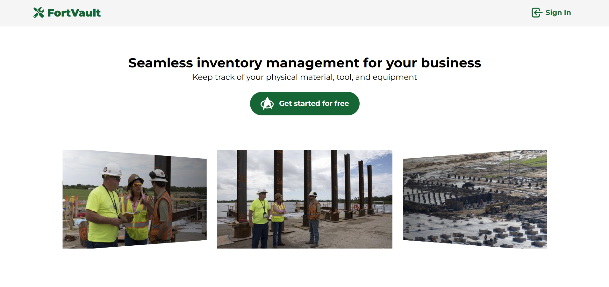

## Background Info

FortVault is a robust inventory management application, designed to simplify inventory tracking and management for field workers. It enables users to efficiently lend, borrow, and track inventory between manager and workers. This application is built using PostgreSQL, Flask, and React TypeScript stack.

Link to the backend repository can be found here: [FortVault Server](https://github.com/KevinPramudyanto/fortvault-server)

## Table of Contents

- [Screenshots](#screenshots)
- [Features](#features)
- [Technologies Used](#technologies-used)
- [ERD & Planning Materials](#erd--planning-materials)
- [Getting Started](#getting-started)
- [Running The Application](#running-the-application)
- [Folder Structure](#folder-structure)
- [Future Enhancements](#future-enhancements)
- [Attributions](#attributions)

## Screenshots

### Signup Page

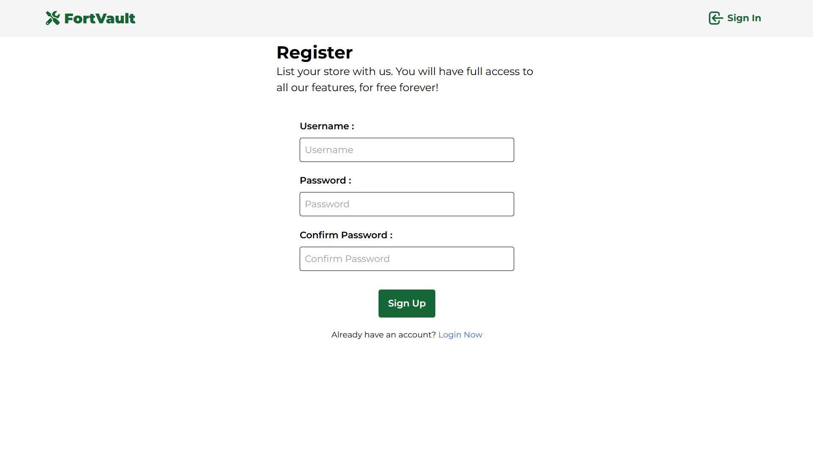
User can create an account, as a store manager.

### Signin Page

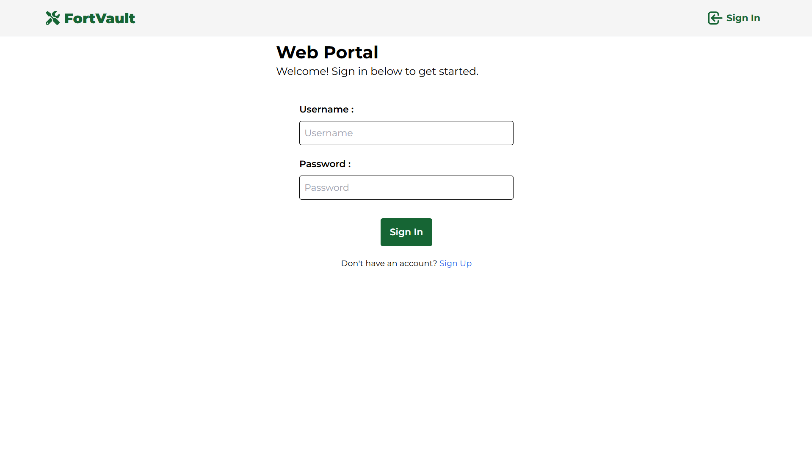
User can login to their account. Store manager will be able to manage their inventory and their workers. Worker will be able to view and borrow their manager's inventory.

### Inventory Page


Upon login, user will be redirected to the inventory page. Manager will get an overview of their inventory, and worker can see their manager's inventory.

### Manage Inventory Page

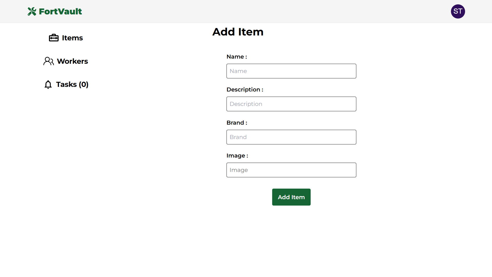
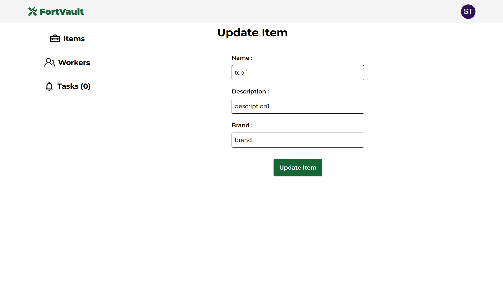

Only manager is allowed to create, update, and delete their inventory.

### Borrow Inventory Page

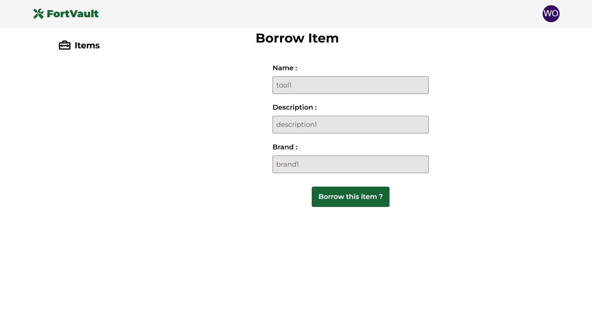
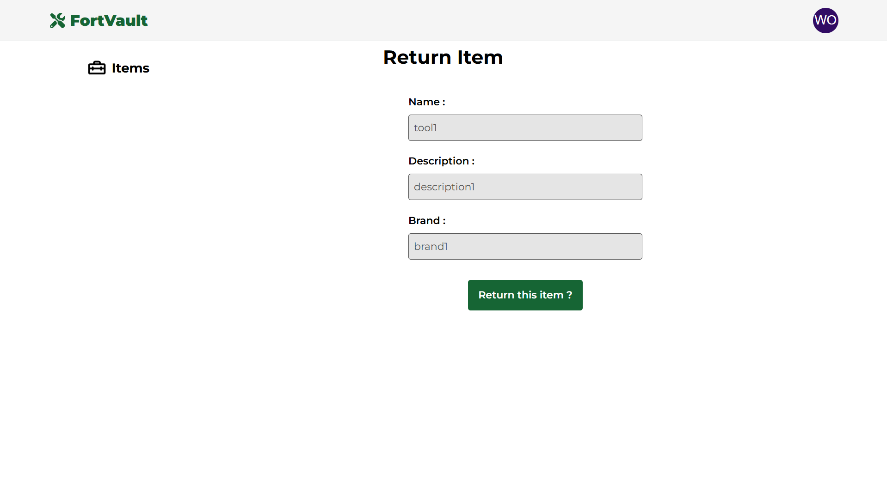
Only worker is allowed to borrow and return their manager's inventory.

### Approve Inventory Page

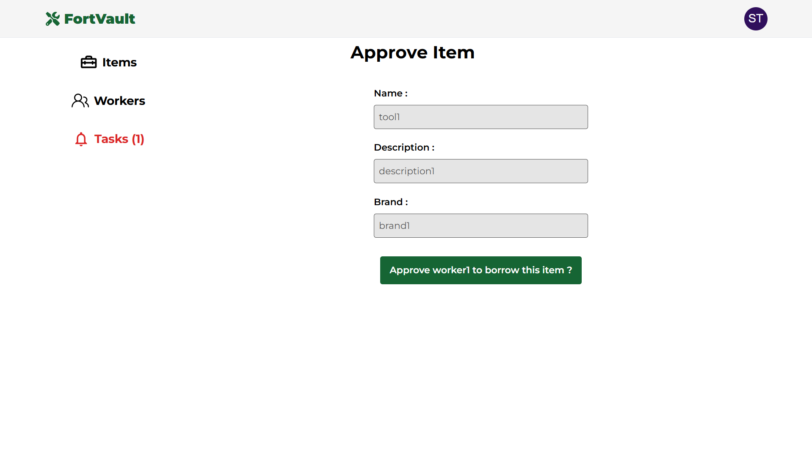
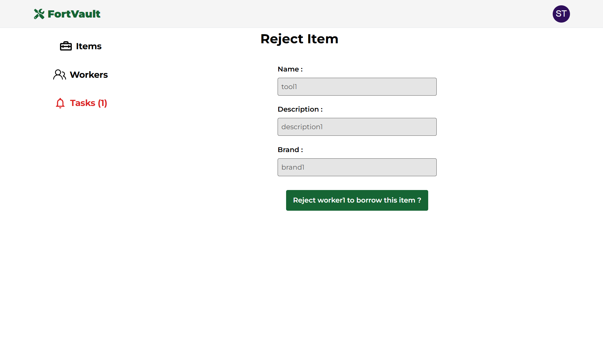
After worker requests to borrow, their manager will be able to either approve or reject the request.

### Manage Worker Page

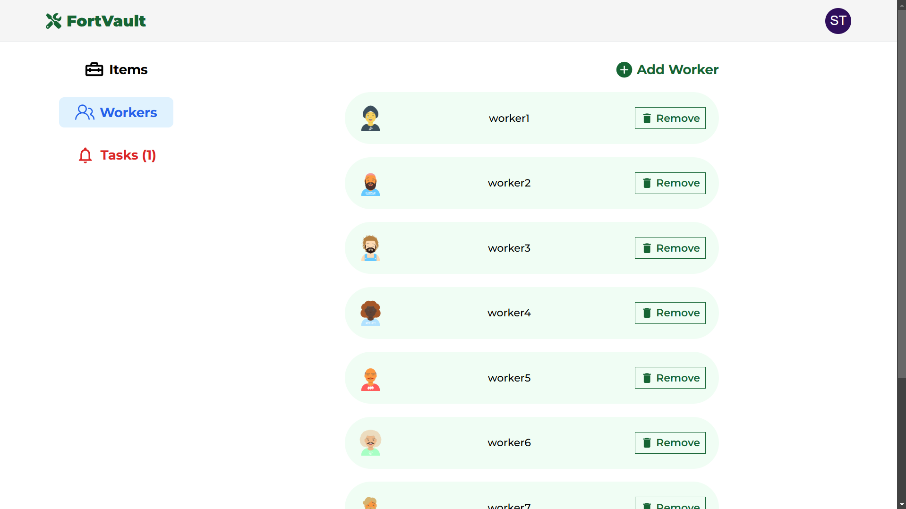
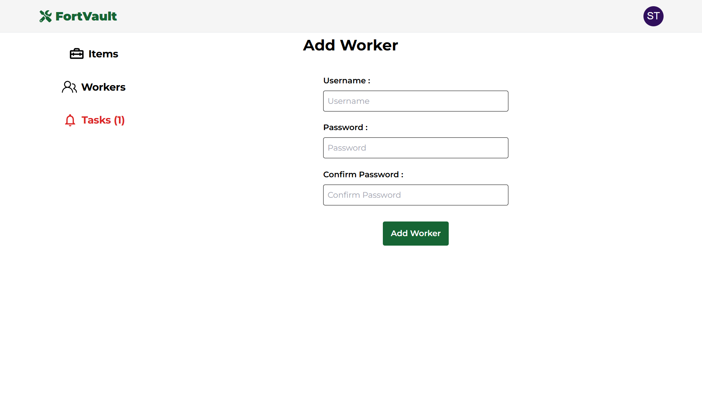
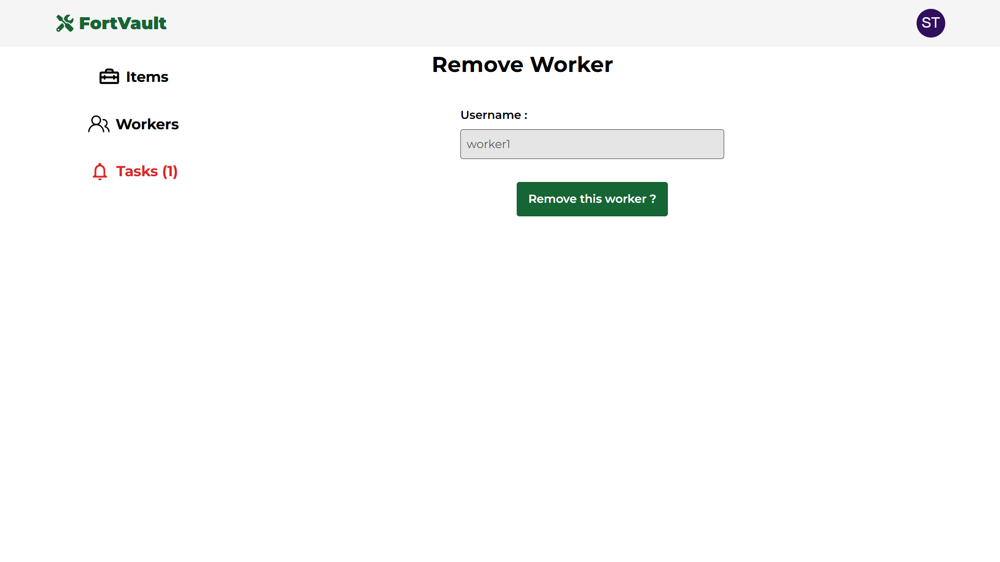
Manager will be able to create account for their new worker. Also they can view all their workers, or delete account of their worker.

### Notification Page

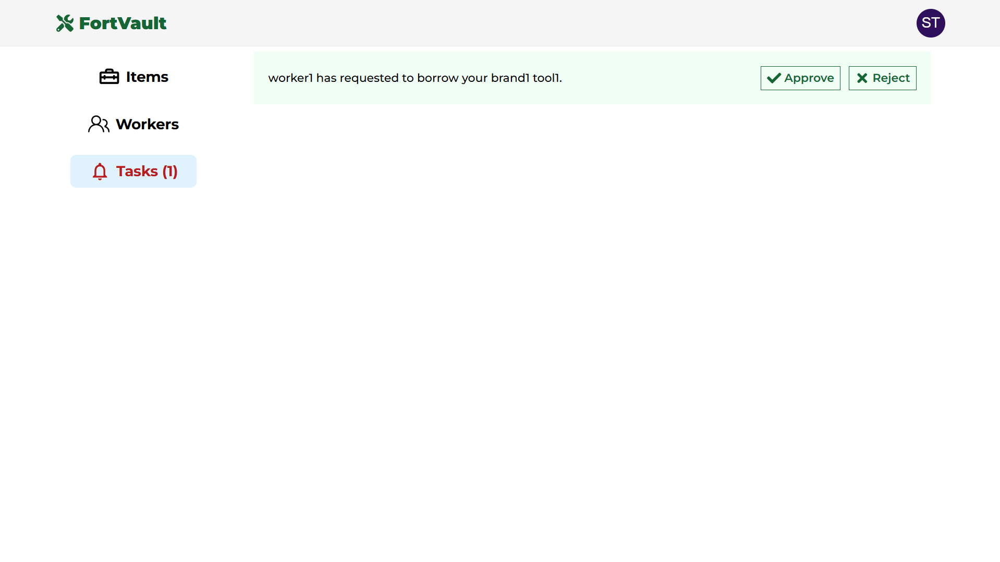
Manager will be able to view if any pending tasks.

### Change Password Page

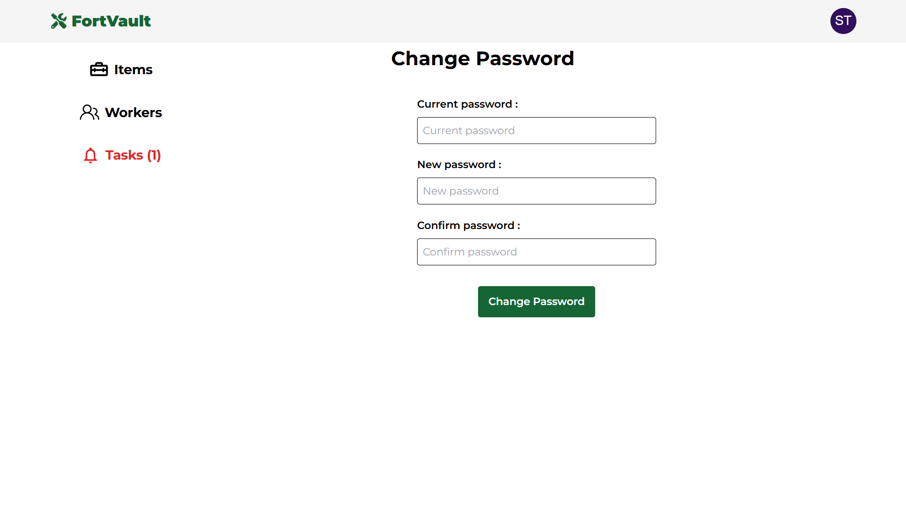
Users (both manager and worker) can change their password.

### Statistics Page

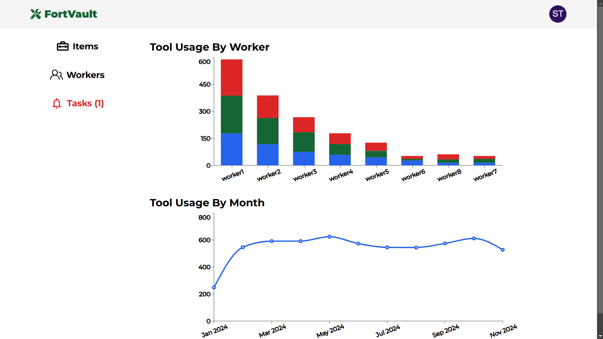
Displays analytics about tools, workers, and operational efficiency.

## Features

- **Landing Page**: Provide brief overview of the app and its functionality to attract potential new users
- **Inventory Management**: View, add, update, or delete inventory, including image uploads
- **Worker Management**: Seamlessly add, update, and manage worker accounts
- **Profile Control**: Update account settings, such as password changes
- **Data Analytics**: Gain insights into inventory and worker activities through visually appealing charts
- **Responsive Design**: Optimized for a seamless experience across all devices, from smartphones to desktops.

## Technologies Used

### Frontend

- **React TypeScript**: Powerful library for building dynamic user interfaces
- **Vite**: Fast development environment and bundler
- **React Router**: Simplified routing for React applications
- **TanStack Query**: Efficient data fetching and state management
- **Axios**: For making API requests
- **Tailwind CSS**: Utility-first CSS framework for styling

### Backend

- **Flask**: Lightweight Python web framework
- **PostgreSQL**: Reliable relational database for data storage
- **psycopg2-binary**: PostgreSQL database adapter for Python
- **flask-jwt-extended** - Authentication with JSON Web Tokens

### API

- **Cloudinary**: Cloud-based media management for image uploads
- **NASA**: Curated images for slideshows

## ERD & Planning Materials

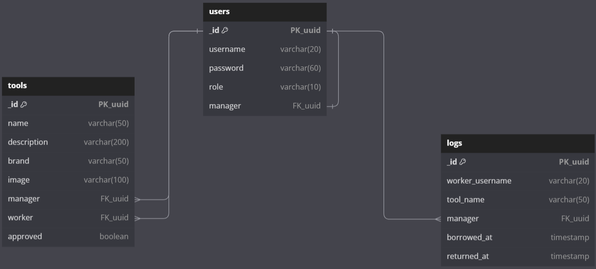

The `tools` table references the `users` table, and the `logs` table references the `users` table.

User Stories and Stretch Goals : [Trello Board](https://trello.com/b/Ch66DBxd/fortvault)

## Getting Started

### Prerequisites

1. Install [PostgreSQL](https://www.postgresql.org/download)
2. Sign up for a Cloudinary account [here](https://cloudinary.com)

### To Run Locally

#### Frontend (fortvault)

1. Clone the repository:

   ```
   git clone https://github.com/KevinPramudyanto/fortvault.git
   ```

2. Navigate to the project directory:

   ```
   cd fortvault
   ```

3. Install dependencies:

   ```
   npm install
   ```

4. Create a `.env` file with the following variables:

   ```
   VITE_SERVER_URL=http://localhost:5001
   VITE_CLOUDNAME=<your-cloudinary-cloudname>
   ```

#### Backend (fortvault-server)

1. Clone the repository:

   ```
   git clone https://github.com/KevinPramudyanto/fortvault-server.git
   ```

2. Navigate to the project directory:

   ```
   cd fortvault-server
   ```

3. Install dependencies:

   ```
   pipenv install
   ```

4. Set environment variables:

   ```
   CLOUD_NAME=<your-cloudinary-cloudname>;
   DB=<your-database-name>;
   DB_HOST=localhost;
   DB_PASSWORD=<your-database-password>;
   DB_PORT=5432;
   DB_USER=<your-database-username>;
   JWT_SECRET_KEY=<your-secret-key>;
   UPLOAD_PRESET=<your-cloudinary-upload-preset>
   ```

5. In PostgreSQL, create all tables using codes from [query.sql](https://github.com/KevinPramudyanto/fortvault-server/blob/main/query.sql)

## Running The Application

### Start the backend server

Run `main.py` in the `fortvault-server` directory.

### Start the frontend client

Run `npm run dev` in the `fortvault` directory.

## Folder Structure

#### Frontend (fortvault)

```
fortvault/
├── src/
│   ├── api/            # Axios API logic
│   ├── components/     # React components
│   ├── context/        # React context providers for state management
│   ├── pages/          # Page-level components
├── .env                # Environment variables
├── package.json        # Project configuration and dependencies
```

#### Backend (fortvault-server)

```
fortvault-server/
├── resources/         # API routes and request handling
├── db/                # Database setup and connection
├── Pipfile            # Python dependencies
```

## Future Enhancements

1. **Email-Based Password Recovery**: Allow users to reset their password via email
2. **Real-Time Notifications**: Push notifications for task updates and approvals
3. **Real-Time Chat**: Integrated chat feature for seamless communication between manager and worker
4. **Subscription-Based Payment**: Introduce premium features with monthly or annual plans

## Attributions

### Resources

- Font: [Montserrat](https://fonts.google.com/specimen/Montserrat) by Google Fonts
- Components: [Material UI](https://mui.com/material-ui/all-components)
- Charts: [Recharts](https://recharts.org/en-US)
- Image slider: [Swiper](https://swiperjs.com/react)
- Icons: [React Icons](https://react-icons.github.io/react-icons)
- Icons for the title bar:
  - Default icon: [Flaticon](https://www.flaticon.com/free-icon/safe_2489669)
  - Success icon: [Flaticon](https://www.flaticon.com/free-icon/check_5610944)

### References

- [Tailwind CSS Documentation](https://tailwindcss.com)
- [TanStack Query Documentation](https://tanstack.com/query/latest)
- [Axios Documentation](https://axios-http.com)
- [Flask-JWT-Extended Documentation](https://flask-jwt-extended.readthedocs.io/en/stable)
- [Requests Documentation](https://requests.readthedocs.io/en/latest)
